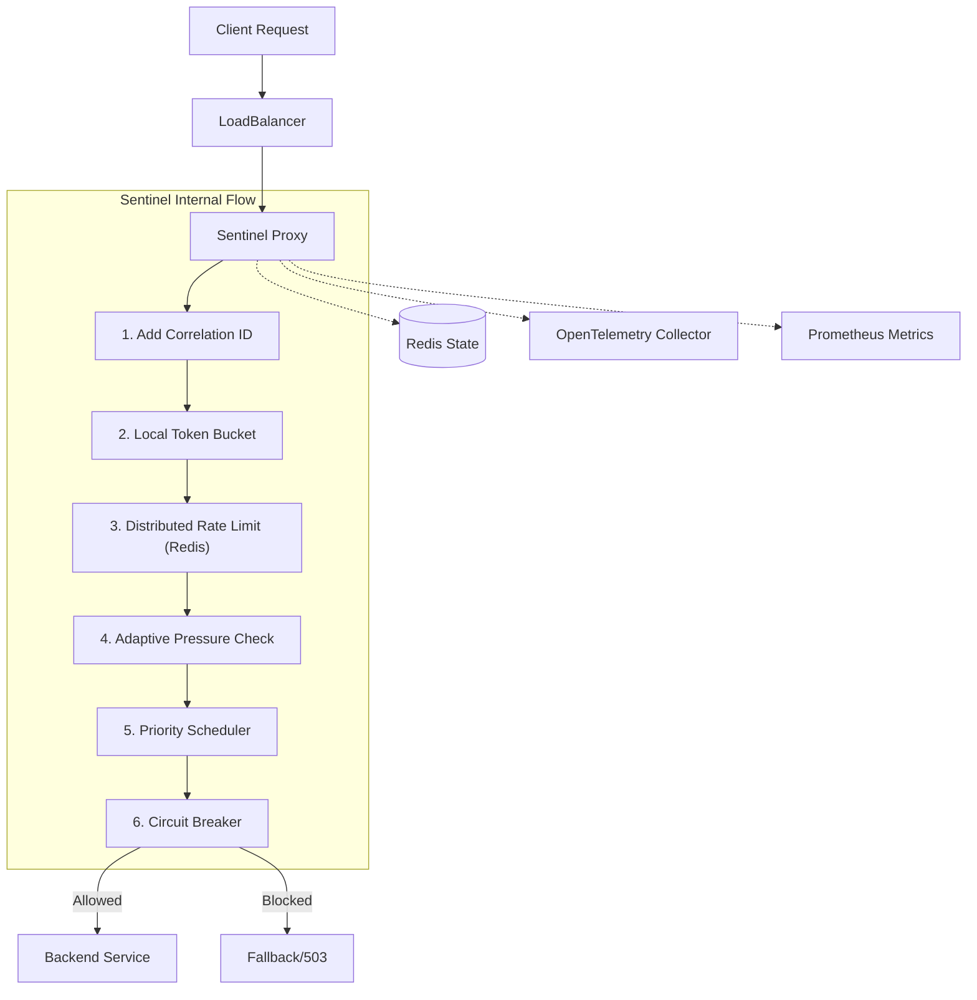

1# Sentinel Microservice

**Sentinel** is a high-performance, resilient API Gateway and Reverse Proxy built with [Bun](https://bun.sh) and [Fastify](https://fastify.dev). It is designed to protect downstream services with advanced traffic control mechanisms, including distributed rate limiting, adaptive pressure handling, and circuit breaking.

## Key Features

- **🚀 High Performance**: Built on the Bun runtime for ultra-fast I/O.
- **🛡️ Distributed Rate Limiting**: Redis-backed sliding window limiters with local token bucket bursting.
- **📉 Adaptive Pressure Control**: Monitors global system pressure in real-time and sheds load dynamically.
- **🔌 Distributed Circuit Breaker**: Protects failing downstream services by failing fast across all proxy instances.
- **👑 Tenant Priority Scheduling**: Prioritizes traffic based on tenant tiers (Vital, Standard, Economy).
  - **Vital**: Guaranteed throughput.
  - **Standard**: Fair share.
  - **Economy**: Best effort (shed first under load).
- **👀 Advanced Observability**:
  - **Tracing**: Full OpenTelemetry integration (supports OTLP).
  - **Metrics**: Prometheus RED (Rate, Errors, Duration) and SLO metrics.
  - **Logging**: Structured JSON logging with correlation IDs.

## System Architecture

Sentinel acts as a smart shield for your backend services.



### Request Lifecycle

1.  **Identification (Tracing)**: Each request is assigned a unique `x-correlation-id` and an OpenTelemetry span (`proxy_request`) starts.
2.  **Local Protection (Token Bucket)**: A fast, in-memory check to prevent single-instance overload. Rejects with `429` if the local bucket is empty.
3.  **Distributed Rate Limiting (Redis)**: Checks global usage for the tenant across all instances. Limits are adapted dynamically based on **Global System Pressure**.
4.  **Priority Scheduling**:
    - **Vital**: Guaranteed access.
    - **Standard**: Allowed if pressure is low.
    - **Economy**: Shed first during high load (`503 Service Unavailable`).
5.  **Circuit Breaker**: Checks if the downstream service is healthy. If the backend is failing, it "trips" and fails fast (`503`) to allow recovery.
6.  **Forwarding**: If all checks pass, the request is proxied to `DOWNSTREAM_URL` with injected trace headers (`traceparent`).

## Setup & Installation

### Prerequisites

- [Bun](https://bun.sh) (v1.0+)
- Redis (v6.0+)

### Installation

```bash
# Clone the repository
git clone https://github.com/your-org/sentinel.git
cd sentinel

# Install dependencies
bun install
```

### Running the Service

```bash
# Development
bun run dev

# Production
bun run build
bun run dist/index.js
```

### Docker Compose (Full Stack)

To run the entire stack (Sentinel, Redis, Prometheus, Jaeger, Mock Backend):

```bash
docker-compose up --build
```

- **Sentinel**: http://localhost:3000
- **Mock Backend**: http://localhost:8080 (via Sentinel: http://localhost:3000/proxy)
- **Prometheus**: http://localhost:9090
- **Jaeger UI**: http://localhost:16686

Configure the service via environment variables or a `.env` file.

| Variable                | Description                                 | Default                  |
| ----------------------- | ------------------------------------------- | ------------------------ |
| `PORT`                  | Service port                                | `3000`                   |
| `DOWNSTREAM_URL`        | Target backend service URL                  | `http://localhost:8080`  |
| `REDIS_URL`             | Redis connection string                     | `redis://localhost:6379` |
| `LOG_LEVEL`             | Logging level (debug, info, warn, error)    | `info`                   |
| `TENANT_HEADER`         | Header to identify tenants                  | `x-tenant-id`            |
| `BURST_CAPACITY`        | Local token bucket capacity                 | `20`                     |
| `REFILL_RATE`           | Local token bucket refill rate (tokens/sec) | `10`                     |
| `WINDOW_MS`             | Distributed rate limit window (ms)          | `60000`                  |
| `BASE_RATE_LIMIT`       | Base requests per window                    | `100`                    |
| `ENABLE_TRACING`        | Enable OpenTelemetry tracing                | `false`                  |
| `OTLP_ENDPOINT`         | OTLP HTTP Exporter endpoint                 | `undefined`              |
| `SLO_LATENCY_THRESHOLD` | Latency threshold for SLO tracking (ms)     | `200`                    |
| `REQUEST_TIMEOUT_MS`    | Timeout for downstream requests (ms)        | `30000`                  |

### Circuit Breaker Configuration

| Variable                         | Description                             | Default |
| -------------------------------- | --------------------------------------- | ------- |
| `BREAKER_FAILURE_THRESHOLD`      | Failure rate (0-1) to open circuit      | `0.5`   |
| `BREAKER_CONSECUTIVE_FAILURES`   | Minimum failed requests to trip         | `10`    |
| `BREAKER_COOLDOWN_MS`            | Time before trying Half-Open (ms)       | `30000` |
| `BREAKER_HALF_OPEN_MAX_REQUESTS` | Max requests allowed in Half-Open state | `5`     |

## Deployment

### 1. Docker (Recommended for Production)

The best way to deploy Sentinel is as a container. It is compatible with Kubernetes, ECS, Cloud Run, etc.

```bash
docker build -t sentinel-proxy .
docker run -p 3000:3000 -e REDIS_URL=redis://host:6379 sentinel-proxy
```

### 2. Docker Compose (Full Stack)

Best for local development or simple single-server setups. Includes Sentinel, Redis, Prometheus, and Jaeger.

```bash
docker-compose up -d --build
```

### 3. Bare Metal / VM (Bun Runtime)

For maximum performance without virtualization overhead. Requires [Bun](https://bun.sh) and an external Redis.

```bash
bun install
bun run build
export REDIS_URL=redis://localhost:6379
bun run dist/index.js
```

### 4. Kubernetes (Production)

We provide standard manifests in the `k8s/` directory.

```bash
# 1. Deploy Redis (if not using managed cache)
kubectl apply -f k8s/redis.yaml

# 2. Deploy Sentinel
kubectl apply -f k8s/sentinel-deployment.yaml
kubectl apply -f k8s/sentinel-service.yaml
```

## Observability

### Metrics

Prometheus metrics are available at `GET /metrics`.

**Key Metrics:**

- `sentinel_http_requests_total`: Total request count (by method, route, status).
- `sentinel_http_request_duration_seconds`: Latency histogram.
- `sentinel_active_requests`: Current in-flight requests.
- `sentinel_pressure_global`: Current global pressure score (0-100).
- `sentinel_circuit_breaker_state`: Breaker state (0=Closed, 1=Open, 2=Half-Open).

### Tracing

To enable distributed tracing, set:

```bash
export ENABLE_TRACING=true
export OTLP_ENDPOINT=http://localhost:4318/v1/traces
```

Traces will include spans for internal components (`token_bucket_check`, `distributed_limiter_check`, etc.) and propagate context to downstream services via `traceparent` headers.

## API Usage

### Tenant Plans

Requests are categorized by tenant tiers based on `x-tenant-id`.
_(Note: Implementation logic for mapping tenants to plans is located in `src/scheduler/tenantPlan.ts`)_.

- **Header**: `x-tenant-id: <tenant-uuid>`
- **Response Headers**:
  - `x-correlation-id`: Unique request ID.
  - `x-ratelimit-remaining`: Remaining requests in window.

## Benchmarking

To test the performance of the proxy, you can run the included benchmark script (uses `autocannon`).

```bash
bun run scripts/benchmark.ts
```

_Note: Enable `LOG_LEVEL=error` or `warn` during benchmarks to avoid logging overhead._

## License

This project is licensed under the MIT License - see the [LICENSE](LICENSE) file for details.
